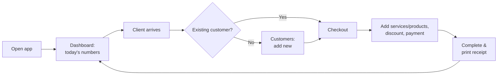
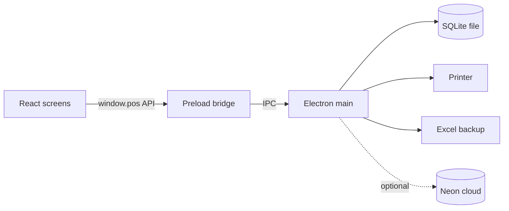

# Offline POS: Complete Project Guide

*Updated 24 Sep 2026, based on the code at commit `22a3b3c`.*

Offline POS is a desktop point-of-sale app for a salon or beauty parlour. It runs on a Windows PC. It handles customers, service and product billing, loyalty points, stock, reports, and printed receipts. It needs **no internet and no server**. All data is kept on the salon's own computer, and the owner can back it up to an Excel file at any time.

---

## 1. At a glance

| What | Detail |
|---|---|
| Type | Desktop app for Windows; a Linux AppImage build also exists |
| Works offline | Yes, fully. No internet is needed for any feature |
| Currency | Pakistani Rupee (PKR) |
| Where data lives | One local database file on the PC (`offline-pos.sqlite3`) |
| Backup | One click, saved as an Excel file (`.xlsx`) |
| Loyalty | Customers earn points on **services**. Default is 1 point per 15 PKR, and the owner can change it |
| Receipts | On-screen preview, then printed on any Windows printer |
| Users / login | None. The app opens straight to the dashboard |
| Optional cloud copy | Sales and customers can be pushed to an online database (Neon). This is off by default |

---

## 2. Screens

The left sidebar has 7 icons. Hover over one to see its name.

1. **Dashboard**: a snapshot of today
2. **Customers**: the customer directory and each customer's profile
3. **Checkout**: make a bill and print a receipt
4. **Services**: the salon's service catalogue
5. **Reports**: business performance
6. **Inventory**: products and their stock
7. **Settings**: salon details, loyalty rules, backup and restore

The salon name from Settings is shown at the top of the sidebar.

---

### 2.1 Dashboard

This is the first screen the front desk sees.

**Summary cards**

| Card | What it shows |
|---|---|
| Total customers | Number of active (not deleted) customers |
| Today's visits | Bills made today that include at least one service |
| Revenue | Today's total sales, plus this month's total underneath |
| Loyalty points | Total points all customers currently hold, plus points earned today |

**Quick actions**
- **New Transaction** opens Checkout.
- **Add Customer** opens the Customers screen with the "Add customer" form.
- **Services** and **Reports** open those screens.

**Recent visits**
- Shows the last 6 bills that included a service.
- Each row shows customer, services, amount, points earned and time.
- Bills with only products are not listed here.

---

### 2.2 Customers

The screen has two parts: a searchable list on the left and the selected customer's profile on the right.

**Finding a customer**
- Type a name, phone number or email in the search box. Results update as you type (up to 20).
- With an empty search box, customers are listed with the most recent visitor first.
- Each row shows name, phone and number of visits.
- The **New customer** button opens the add-customer form. The fields are Name (required), Phone, Email and Notes.

**Customer profile.** Click a customer to see:

| Card | Meaning |
|---|---|
| Visits | How many times they have been billed |
| Points earned | Total points earned from services |
| Points redeemed | Total points spent on free services |
| Loyalty balance | Points available now |
| Last visit | Date of the most recent bill |

- **Service taken** lists the services from their most recent visit, with quantity and price.

**Actions on the profile**
- **Edit customer**: change name, phone, email or notes.
- **Redeem loyalty**: give a free service for points (see section 3.3).
- **Transaction history**: every receipt for this customer, with date, receipt number, payment method, total, points and item lines.
- **Delete customer**: hides the customer from all lists. Their past bills stay in the records.
- **Clear selection**: closes the profile.

---

### 2.3 Checkout (making a bill)

Checkout is the only place where sales are made. The left side builds the bill and the right side shows the basket and totals.

**Step by step**
1. **Choose the customer.** Search by name or phone. A card appears with their phone and current points. A customer is **required**. There is no "walk-in" option, so a new client must be added as a customer first.
2. **Add products.** Pick from the "Add product" dropdown, which shows price and stock on hand. A **barcode scanner** also works on this screen: scan an item and it is added automatically.
3. **Add services.** Pick from the "Add service" dropdown, which shows code and price.
4. **Adjust the basket.** Use **+** and **−** to change quantity, **Remove** to drop a line, and **Clear** to start over.
5. **Discount (optional).** Toggle between a fixed **PKR** amount or a **%**. A percentage applies to the amount before tax.
6. **Payment method.** Choose Cash (default), Card, Bank Transfer or Digital Wallet. This only records how the customer paid. The app does not process card or bank payments.
7. **Check the totals.** The basket shows Subtotal, Tax, Discount, **Points this sale** and the final **Total**.
8. Click **Complete & view receipt**. The button stays disabled until a customer is selected and the basket has at least one item.

**What happens when a sale is completed**
- The bill is saved with a receipt number such as `T-20260924-00042`.
- Product stock goes down by the quantity sold.
- The customer's visit count goes up by 1 and their last-visit date is updated.
- Loyalty points for the services are added to the customer's balance.
- A **receipt preview** opens, with **Print receipt** and **Done** buttons.

**Receipt contents**
- Salon name, tagline, phone and address (from Settings)
- Receipt number, customer name, cashier and date/time
- Each item with quantity × price and line total
- Subtotal, Tax, Discount, Total and payment method
- Points earned, and "Thank you for your visit!"

Printing opens the normal Windows print dialog, so any installed printer can be used. The receipt is about 280 px wide, which suits thermal receipt printers.

The **Recent transactions** list below the basket shows the last 6 receipts.

---

### 2.4 Services

This screen holds the salon's service menu, for example Facial, Hair Spa and Manicure.

**Add a service**

| Field | Notes |
|---|---|
| Code | Required and must be unique, e.g. `FAC-1001` |
| Name | Required |
| Description | Required |
| Price | In PKR |
| Redeem for free at (points) | How many loyalty points buy this service free. `0` means it cannot be redeemed |

**Active services** table: name, code, price, redeem points, description and a **Delete** button.

**Deleting (two-step safety)**
1. **Delete** hides the service from Checkout. It moves to a "Deleted services" list.
2. Click **Show deleted** to see that list. From there you can:
   - **Restore** it, which brings it back, or
   - **Delete permanently**, which removes it forever after a confirmation.

---

### 2.5 Inventory (products)

This screen holds retail products sold over the counter, such as shampoo or creams.

**Add a product**

| Field | Notes |
|---|---|
| Product name, Category | Required |
| SKU, Barcode | Required and must be unique. The barcode is what the scanner reads |
| Price | In PKR |
| Starting stock | Quantity on hand |
| Tax rate | Entered as a decimal: `0.08` = 8%, `0` = no tax |
| Redeem for free at (points) | Stored for future use. Products cannot be redeemed with points yet |

**Active items** table
- Shows stock, price and redeem points for each product.
- Quick stock buttons: **−1**, **+1**, **+10**. Every change is logged.
- Stock can never go below zero.

**Deleting products** follows the same two-step process as services: **Delete**, then **Show deleted**, then **Restore** or **Delete permanently**.

---

### 2.6 Reports

Reports cover **all time** (there is no date filter yet).

| Section | Figures |
|---|---|
| Headline cards | Total revenue and number of transactions; customers (total and active); visits (total and today); loyalty balance and points redeemed |
| Sales & billing | Revenue, tax collected, discounts; top 5 products by quantity sold |
| Customer activity | Total, active and new this month; top 5 customers by spend |
| Services & attendance | Total visits, visits today; top 5 services |
| Points movement | Points earned, redeemed and outstanding; top 5 point balances |

The most-used payment method is shown at the top.

---

### 2.7 Settings

**Salon details (printed on receipts)**
- Salon name, tagline, phone, email and address.
- Click **Save salon info** after editing.

**Loyalty rules**

| Setting | Default | Meaning |
|---|---|---|
| Rupees per point (earning) | 15 | 1 point for every 15 PKR spent on services |
| Minimum redeem points | 50 | A customer needs at least this many points before redeeming |

Click **Save loyalty rules** after editing.

**Backup and restore**
- **Backup to Excel** saves the whole database as `salon-backup-YYYY-MM-DD.xlsx`. Each table gets its own sheet, and the file opens in Excel.
- **Restore from Excel**:
  - Pick a backup file and confirm.
  - The data in the app is **replaced** by the data in the file. It is not merged.
  - The app then reloads.

---

## 3. Business rules

### 3.1 Prices, tax and discount
- **Tax** applies per product line (price × qty × tax rate). **Services have no tax.**
- **Discount** is taken off at the end: Total = Subtotal + Tax − Discount.
  - A PKR discount cannot exceed the bill.
  - A % discount is between 0 and 100% and applies to the pre-tax subtotal.

### 3.2 Earning points
- Points come from **services only**. Products never earn points.
- Formula: service amount ÷ "Rupees per point", rounded down. For example, a 3,500 PKR facial earns 233 points at the default rate.
- Points are calculated **before** any discount.
- Points are added the moment the sale is completed, and show on the receipt.

### 3.3 Redeeming points (free service)
1. Open the customer's profile and click **Redeem loyalty**.
2. The app lists every service the customer can afford with their current balance.
3. Click a service and confirm. Its points are deducted and the redemption is logged in their history.

Rules:
- The customer's balance must be at least the "Minimum redeem points" setting (default 50).
- A redemption does not create a bill or receipt. It only deducts points.

### 3.4 Stock
- Selling a product reduces its stock automatically.
- The app will **not** let you sell more than the stock on hand.
- Every stock change, whether from a sale or a manual adjustment, is recorded.

### 3.5 Deleting things safely

| Item | Delete | Restore | Permanent delete |
|---|---|---|---|
| Services | Yes (hidden) | Yes | Yes (only after delete) |
| Products | Yes (hidden) | Yes | Yes (only after delete) |
| Customers | Yes (hidden) | Not yet | Not yet |

Past bills are never removed. Receipts keep the item names and prices as they were at the time of sale.

---

## 4. A typical day



1. **Morning:** open the app. The Dashboard shows today's revenue and visits, starting from zero.
2. **Client arrives:** search for them in Checkout. If they are new, add them under Customers first.
3. **Billing:** add the services and products, apply a discount if needed, choose the payment method, then Complete and print.
4. **Loyal client:** open their profile, click **Redeem loyalty** and give a free service.
5. **Stock arrives:** go to Inventory and use **+1** or **+10** on the product.
6. **Evening:** check Reports. Take a **Backup to Excel** at least once a week and keep it on a USB drive or Google Drive.

---

## 5. Data, privacy and backup

- All data stays on the salon PC in a single database file:
  `C:\Users\<username>\AppData\Roaming\Offline POS\offline-pos.sqlite3`
- This folder is separate from the app's install folder. **Updating or reinstalling the app does not erase data.**
- If the PC is lost or broken, the data is lost too, unless there is a backup. That is why the Excel backup matters.
- **What is stored:** products, services, customers, transactions and their items, loyalty history, stock movements and settings.

**Optional cloud copy (Neon)**
- When a developer sets the `NEON_DATABASE_URL` setting on the PC, the app pushes new sales, customers and manual stock changes to an online Neon database every 30 seconds.
- This is off by default, and there is no button for it in the app.
- It is one-way: the app sends data up and never downloads.

---

## 6. Installation

**For the salon (end user)**
1. Receive the installer, `Offline POS Setup <version>.exe`.
2. Double-click it. If Windows shows "Unknown publisher", click **More info**, then **Run anyway**. This appears because the app is not code-signed.
3. Choose the install folder, then Install and Launch.
4. On first launch, sample data is added: 3 services, 3 customers and 5 products. Delete it and enter the real catalogue.
5. Go to **Settings** and enter the salon details and loyalty rules.

**PC requirements**
- Windows 10 or 11.
- Screen resolution of at least **1280 × 820**. This is the minimum window size.
- A printer, which is optional. A thermal receipt printer is recommended.
- A USB barcode scanner that acts as a keyboard, which is optional.

**For the developer.** Full steps are in [DEPLOYMENT.md](DEPLOYMENT.md).

```bash
npm install          # install dependencies
npm run electron:dev # run in development mode
npm run dist:win     # build the Windows installer into release/
```

The Windows installer must be built on a Windows machine, because the database library is compiled for each OS.

---

## 7. How it is built (technical)

| Layer | Technology | File |
|---|---|---|
| Screens (UI) | React 19 + TypeScript, built with Vite | `src/App.tsx`, `src/styles.css` |
| Desktop shell | Electron 37 | `electron/main.ts` |
| Bridge between UI and data | Electron preload (secure IPC) | `electron/preload.ts` |
| Database & business logic | SQLite via better-sqlite3 | `electron/db.ts` |
| Shared data types | TypeScript | `electron/schema.ts` |
| Excel backup | SheetJS (`xlsx`) | `electron/db.ts` |
| Optional cloud copy | Neon (serverless Postgres) | `electron/sync.ts` |
| Installer | electron-builder (NSIS for Windows, AppImage for Linux) | `package.json` |



The screens never touch the database directly. They call a safe API (`window.pos`), and the Electron main process does the work.

**Database tables**

| Table | Holds |
|---|---|
| products | Retail items, stock, tax, redeem points |
| services | Service catalogue |
| customers | Profiles, points balance, visit count |
| transactions | One row per bill |
| transaction_items | Lines of each bill |
| loyalty_transactions | Every point earned or redeemed |
| inventory_movements | Every stock change |
| app_settings | Salon info and loyalty rules |
| sync_queue | Records waiting to go to the cloud |

The older tables `sales`, `sale_items` and `visits` are from an earlier version. Their data is moved into `transactions` automatically when the app starts.

---

## 8. Known issues and limitations

These were found while reviewing the code for this guide.

### Bugs to fix before handing over

| # | Issue | Effect |
|---|---|---|
| 1 | **Adding a new customer fails.** The database insert in `createCustomer` (`electron/db.ts:1854`) lists 9 columns but passes 10 values; the `notes` column is missing | "New customer" and "Add Customer" do not save. Only the sample customers work, so no new client can be billed |
| 2 | Checkout errors are not shown | If a sale fails, for example "Not enough stock", nothing appears on screen |
| 3 | The Complete button can be double-clicked | A fast double click may save the same bill twice |
| 4 | The Reports "From checkout" figure is always 0 | It counts an old sale type, not the current one |
| 5 | Redeem list ignores the minimum | A service costing fewer points than the "Minimum redeem points" setting shows as available but fails when clicked |
| 6 | Dates use UTC time | Bills between 12 am and 5 am Pakistan time get the previous day's date in the receipt number and "today" figures |
| 7 | Printing may cut off | The print window closes right after sending the job. Test on the salon's actual printer |
| 8 | The GitHub build workflow is broken | It calls `npm run dist`, which does not exist. Build locally with `npm run dist:win` instead |

### Not available yet
- Editing a product or service after it is created. You have to delete it and add it again.
- Restoring or permanently deleting a customer.
- Low-stock alerts.
- Refunds, voids or returns.
- Date-range reports and report export.
- Staff logins or multiple cashiers. The cashier name is fixed as "Amina Khan".
- A tax setting. Tax is set per product only.
- Redeeming **products** with points. Only services can be redeemed.
- A cloud-sync status or button in the app.

### Minor text and cleanup
- The sample products are grocery items (bread, milk), not salon items.
- The sample customers have points but no history.
- Some labels are outdated:
  - The Inventory page header reads "Cashier station".
  - The deleted-items table header reads "Service / Stock / Rate".
  - The empty basket says "tap a product".
- The old "New Visit" and "New Bill" forms are still in the code but can no longer be reached.
- Two older docs are out of date and should be retired or updated: `docs/COMPLETE_APP_DOCUMENTATION.md` and `PROJECT_STATUS.md`. They still describe separate POS and Billing screens, walk-in customers, and SQLite-file backups.
